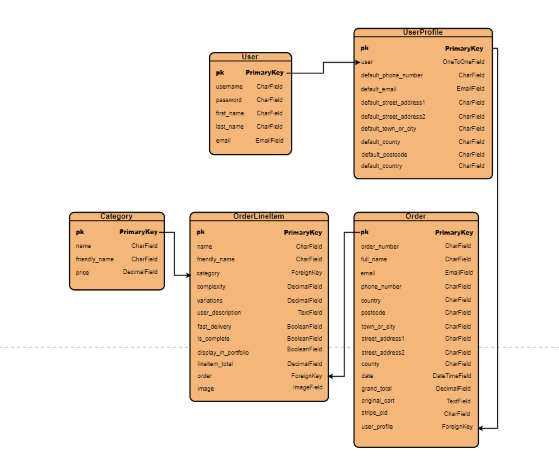

# [GraphicsDivine](https://graphics-milestones-4.herokuapp.com/)

Graphics Divine is an online graphics store. Users can view the designer's portfolio, and if they wish to purchase a graphic, they can go to the order page, choose from a few options, and leave a description of how they would like their product to look.

## **UX**

### **User Stories**

#### **As an anonymous or 1st-time user, I would like to...**

* view the designer's portfolio.
* purchase a customised graphic design
* be able to use the website on mobile, tablet, and desktops/laptops.
* be able to contact the designer for more info.

#### **As a regular user, additionally, I would like to...**

* create an account.
* log in to my account.
* log out of my account.
* change my password.
* view my order history
* save my billing details for future purchases.


#### **As the site owner, I would like to...**

* upload/remove images to a portfolio page.
* receive payment for my work.
* receive enquiries from prospective customers.
* receive and view orders. 

### **Design**

The design was chosen to be a bit fancy to make it stand out as it's a design website. It has a sky theme with high contrasting text and button colors to add some life to the cloud-like backdrop. The button/text colors were also chosen to help the user progress their way to achieving whatever goal they have in using the site. 
* Pink: rgba(250, 92, 119, 1)
* Blue: rgba(80, 110, 250, 1) 

I used Adobe Color Wheel to find these colors and make sure they complimented each other.

### **Typography**
The main font used throughout the site is [Goldman](https://fonts.google.com/specimen/Goldman). It has an elaborate look to it that might suit a design website.


### **Wireframes**

The wireframes are just simple sketches of what the layout was to become.

They can be found [here](readme/wireframes)

### **Database**
sqlite3  was used as the database during development and 
Heroku Postgres database was used for production. 
Heroku Postgres can be found by searching in the Add-ons form in the Resources tab in your projects Heroku dashboard.
The entity-relationship diagram representing the models used in this project can be seen below.



## **Features**
### **Home Page**
The home page consists of an animated carousel and a section for the graphic designer to write info about the website. 

#### **Portfolio Page**

This page has a collection of product images that can be filtered by product price and complexity.

#### **Order Page**
Here, the user can use a form to create a customised product order. They can choose from a few options that are necessary for pricing, and then input a description of what the product should look like when complete. When they submit the form, the order is sent to the cart. Then they are given the option to go to the cart or create another product order.

#### **Cart**
The cart app gives the user the option to proceed to the checkout, delete items, or return to create another product order. 

#### **Checkout**
In the checkout, the user can view the order and its total cost and then fill out a form before using Stripe to pay.  if they are an authenticated user, they have the option to save the billing information to their profile.

#### **Profile Page**
The profile page app contains a form for storing the user's billing information which they can update and view their complete order history.

#### **Allauth**
Allauth is a set of apps that give the user the ability to register, login, logout, verify their email, and change their password. All of these features are implemented on this site. 

### **Django Admin**
Django has site admin functionality available. it is used in this project and allows the site owner to view users, orders, order line items, upload/remove images to the site among other things.

## **Technologies Used**

* [HTML](https://developer.mozilla.org/en-US/docs/Web/HTML) Markup language used for building all webpages on the site.
* [CSS3](https://developer.mozilla.org/en-US/docs/Web/CSS/CSS3)  Declarative language used to style the project.
* [Gitpod](https://www.gitpod.io/) Gitpod is an IDE. All coding was done using Gitpod.
* [GitHub](https://github.com/)  Github is a Git repository hosting service. Was used to store all versions of this project as it progressed.
* [Heroku](https://www.heroku.com)  Cloud platform used to host the project.
* [Bootstrap 4.5](https://https://getbootstrap.com/) Used for a lot of the styling and layout.
* [jQuery 3.5](//https://jquery.com/) Used by Bootstrap to do what Bootstrap does for the most part.
* [Django](https://docs.djangoproject.com/en/3.2/) Very useful framework used for creating the backend of the site.
* [Python 3.8.8 ](https://www.python.org/) Used for back-end programming.
* [Heroku Postgress](https://devcenter.heroku.com/categories/postgres-basics) Cloud database used to store the projects database.
* [AWS](https://aws.amazon.com/) For storing static and media files.
* [Stripe](https://stripe.com/ie) For payment functionality.


## **Testing**

### **Register**
Registration was tested by registering with an email account, waiting for a confirmation email, and then confirming. After this, when a login was attempted, it worked as expected. The Django admin showed the new user and their verified email.

### **Password Reset**

After the reset password link was clicked and details entered, the page was redirected to a page stating that a link had been sent to the inbox. The link directed the browser to the password reset page, and after the password was reset, the user account functioned normally. This was repeated several times and always worked.
This didn't work with Outlook though. It seems to be blocking it because the emails always come through on Gmail. This is very strange because all the other emails like email verification and the post-purchase emails came through. 

It could be achieved with debug turned on, and they always went to junk mail. My best guess is that something about debug being on makes them seem even more like junk, or even malicious, and therefore being blocked by Outlook rather than the issue being that the emails were not being sent by the backend. 

### **Confirm Email and Post Purchase Email**
As mentioned above, after completing the necessary steps to trigger these emails, they always came through, even on Outlook. The link provided by the Confirm email worked and verified the account, which could be seen in the admin.
After the post-purchase email was delivered, I checked the events on Stripe and could see the purchase there too.

### **Forms**
The forms were tested to see if they would send without the required fields being filled and that all the correct data was used to create models in the backend. The contact form was tested by checking the data in the emails that were sent. This form would not submit if the required data was not input. 

### **Models**
The models were tested by inputting correct and incorrect data types into their fields. That worked as expected and when successful, orders, billing details, and users were created correctly and shown in admin and the website site pages in with the data they should have. When unsuccessful, Django redirected to the error page and/or a 500 error for the web handler was shown in the terminal. 

Print statements were used throughout the views and handlers that created the models. They were used to track what values were assigned to the model fields and that all parts of the view/handler code was been run under all python conditions. It was shown that only the correct data types and data can be entered into the model's fields on model instantiation.

### **Use of the Website at different Screen Sizes and Browsers**

The site was designed to display correctly for screen sizes as low as 300px wide.
The only issue encountered was the mobile navigation button moved out of position on screens lower than 290px wide. This is acceptable as very few screens are that small.
This was tested using Chrome tools. It has been tested on Chrome, Edge, and Firefox.

### **Website links and Buttons**
All links and buttons on the site were checked to see if they behaved as expected. All links directed to the correct page and all buttons initiated the expected behavior. 

### **Stripe Payments, save_info Variable,and Meta Data**
After a Stripe payment was made, it was shown as a successful event in the Stripe Events section of the Stripe account used for this project. The user was then directed to the checkout_success page where the order was displayed, and a verified payment email was delivered. This order was then displayed on the user profile page. This worked dozens of times.
The cart metadata and save_info variable were also incorporated into the Stripe metadata section in Stripe events. The billing info was saved to the user's profile when the variable was set to true by checking the checkbox on the checkout page.

### **Add Line-items to portfolio Page**
The line items have a "Display on Portfolio" field, that, when true, will enable them to be displayed on the portfolio page. This was tested and worked as expected.

### **Known Bugs**
* The Boostrap Carourousel background images would not load from an externally or internally. They had to be included inline and with a direct link because the Django `{static 'image'} format was cousing a parsing error on validation.


## **Validation**
Links to HTML, CSS, JavaScript, and Python validation text and image files are below. 

[JavaScript](readme/jshint)
[Python](readme/PEP8)
The errors in HTML are template logic related.
[HTML & CSS Validation](readme/html_css_validation)

All CSS, Python, Javascript, and HTML were validated.

* [W3C Markup Validation Service](https://validator.w3.org/) used to validate HTML.
* [W3C CSS Validation Service](https://validator.w3.org/) used to validate CSS.
* [JSHint](https://jshint.com/) used to validate JavaScript.
* [PEP8 Online](http://pep8online.com/) used to validate Python.

The errors coming back are because the validators don't recognize Template Logic.


# Deployment

## Local Deployment

Gitpod, an integrated development environment, was used to code this project. Github was used for version control and storing the project's files remotely.

To run this project you will need to perform the following steps.

### Install Technologies to Your Computer

[PIP](https://pip.pypa.io/en/stable/installing) to install the project's requirements.
[GIT](https://www.atlassian.com/git/tutorials/install-git) for cloning the project and version control.
[Python](https://www.python.org/download/releases/3.0/) to run the project. 

### Clone the Repository

You will need to clone the site's repository.
To do this,  enter `git clone https://github.com/Gerard-Mc/milestone_4.git` into your terminal.
After the repository is cloned, change IDE directory to the one created after cloning by typing `cd <path to project folder>` into your terminal.
You will find more information on cloning repositories [here](https://docs.github.com/en/github/creating-cloning-and-archiving-repositories/cloning-a-repository-from-github/cloning-a-repository)

### Create Accounts

The website requires a Stripe, Gmail, and AWS account.
You will find links to them below.
[Stripe](https://stripe.com/)
[Gmail](https://www.google.com/)
[AWS](https://aws.amazon.com/)

### Set up Environment Variables
* Create an env.py file in the root directory.
* If not already included in the .gitignore file, make sure to add it otherwise your environment files will be visible to the public.
* Paste the following code into the env.py file and input the values found in your Stripe account.
```
import os  
os.environ["DEVELOPMENT"] = "True"    
os.environ["SECRET_KEY"] = "<Your Secret Key>"
os.environ["STRIPE_PUBLIC_KEY"] = "<Your Stripe Public Key>"    
os.environ["STRIPE_SECRET_KEY"] = "<Your Stripe Secret Key>"    
os.environ["STRIPE_WH_SECRET"] = "<Your Stripe WH Secret Key>"    
```
More information on setting up Stripe keys can be found [here](https://stripe.com/docs).

### Install Required Packages

To install the required packages, input `pip3 install -r requirements.txt`
in your terminal.

### Create Database
* You will need to make migrations by inputting `python3 manage.py makemigrations` into your terminal.

* Migrate this data by inputting `python3 manage.py migrate` into your terminal.

### Create a Super User 

To access the website's admin to create objects, you will first have to create an admin account.
* Input `python3 manage.py createsuperuser` into your terminal.
* Follow the steps by inputting a username, email(optional), and a password.
* To open admin, you will need to open the website. To do this type `python3 manage.py runserver` in your terminal and an option to open the website should be available in your IDE.
* After you open the website, add `/admin` to the end of the website's URL to open Admin.
* Click categories and create these four categories: logo, poster, icon, and banner. They must be in that order because their primary keys will be used throughout the site. The friendly name fields should be the same as the name of the category. The price can be anything.
The database and website should now work as expected.

# Deployment
## Remote Deployment

### Set up an AWS account
Images for the website were stored remotely by using a S3 Bucket provided by AWS.
You will need to set up an AWS account, create a Bucket with public access, and input your credentials in the Heroku config vars section of the app's Heroku settings(explained later).
In the settings.py file provided in the repository, input the Bucket name and the region name like the example format below.
```
AWS_STORAGE_BUCKET_NAME = 'your bucket name'
AWS_S3_REGION_NAME = 'the region you choose'
```
The rest of the variables will be handled in the settings.py file included in the repository, and won't need a further configuration. After the Heroku app is created, they will need to be inputted as config vars. That will be shown in the coming Heroku section.

More information on creating and setting up Buckets can be found [here](https://docs.aws.amazon.com/AmazonS3/latest/userguide/creating-bucket.html)

### Create a Heroku App and Deploy
[Heroku](https://www.heroku.com/) was used to host this project. The steps needed to get the project up and running are provided below.

Create a Heroku account and create a new project app.
When prompted, choose the region that is closest to you.
When the app is created, go to the **resources** tab, search for the addon **Heroku Postgress**, and install it to your app.
Go to the **Settings** tab, click **Reveal Config Vars**, and input your environment variables in the below format.
```
AWS_ACCESS_KEY_ID : `<your AWS access key>`
DATABASE_URL: `<your database url>`
AWS_SECRET_ACCESS_KEY: `<your AWS secret access key>`
USE_AWS: `<True>`
SECRET_KEY: `<your secret key>`
EMAIL_HOST_PASS: `<your email password>`
EMAIL_HOST_USER: `<your email address>`
STRIPE_PUBLIC_KEY:  `<your stripe public key>`
STRIPE_SECRET_KEY:  `<your stripe secret key>`
STRIPE_WH_SECRET: `<your stripe wh key>`
```
The database URL in the environment variables is connected to the app in the settings.py file and won't need a further configuration.
```
DATABASES = {
        'default': dj_database_url.parse(os.environ.get('DATABASE_URL'))
    }
```


The requirements.txt and Procfile Heroku will need to run this project are included in the repository files and Heroku will use them in the build automatically.
For reference, they are provided below.
[Procfile](/workspace/milestone_4/Procfile)
[Requirements.txt](/workspace/milestone_4/requirements.txt)

Deploy on Heroku
* Go to **settings > config vars** and input the key **DISABLE_COLLECTSTATIC** and set it to **True** 
* Go to the **Deploy** tab in the Heroku dashboard.
* At **Deployment Method**, choose Github and then connect to your cloned repository.
* Choose **Automatic Deploy**, and click **Deploy Branch **.

Go back to the settings.py file in your IDE, and in the line `ALLOWED_HOSTS =`, add set it equal to your website's address in the format below.

`ALLOWED_HOSTS = ['example.herokuapp.com']`

* Push the changes to Github and go back to **Settings > Config Vars**, and remove **DISABLE_COLLECTSTATIC**.
* Redeploy the website in **Deploy > Deploy Branch** in the Heroku dashboard and the website should be up and running.

* Go to the terminal in Heroku and follow the instructions under the headings **Create Database** and **Create a Super User** in the Local deployment section, and the website should b up and running.